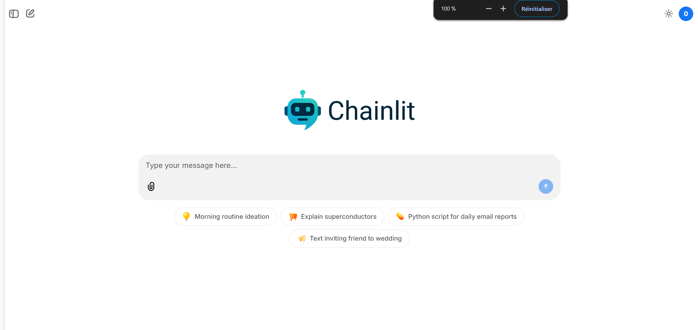

# Chat PDF

Chatbot for chatting with PDFs via a RAG system that provides the LLM with only the relevant document chunks. A chat memory is built in, allowing long discussions with the document.

---



---


---

## Structure

```bash
src/
└── rag
    ├── __init__.py     # Global variables of app
    ├── __main__.py     # Entry point of app
    ├── cli.py          # Entry point of Typer CLI app
    ├── app.py          # Entry point of FastAPI app
    ├── routes.py       # Routes of FastAPI app
    ├── pipeline.py     # Langchain chain functions
    ├── interface.py    # Chainlit interface definition
```

## Installation
You must have installed `python3.12` with `pip`. This project use `uv` as a virtual environment manager. To install it, run the following command:

```command
pip install --upgrade pip
pip install uv
```

Then, create a virtual environment and install the dependencies:

```console
uv sync
```

If your IDE don't create the virtual environment automatically, you can create it manually with the following command:

```command
uv venv
source .venv/bin/activate
```

After this you must copy paste the `.env.example` file to `.env` and fill it with your own values.

```command
cp .env.example .env
```

## Usage
You can run the CLI with the following command:

```command
uv run src/rag
```

```command
python src/rag
```

## Tests

You can run the tests with the following command:

```command
pytest
```
 You will find coverage report in the `htmlcov` folder, just open the `index.html` file in your browser.

## Linting
This project use `ruff` for formatting and linting. You can launch both with `uv` custom command. To do this, run the following command:

```command
uv run lint
```

## Production

This project use Docker, docker-compose and docker tools for publish and deploy the app. 

You can run in local the container with the following command:

```command
docker compose -f compose.prod.yml up --build
```

You can update the preprod or prod with the following command:

```command
make update-preprod
```
